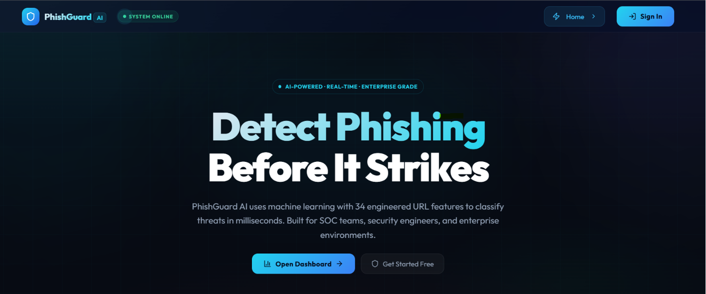
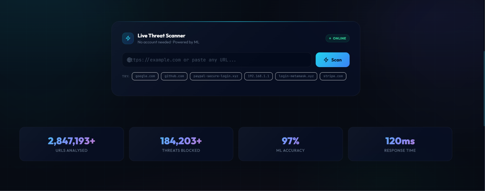

<div align="center">

<h1>🛡️ PhishGuard AI</h1>
<p><strong>Intelligent Phishing URL Detection & Threat Intelligence Platform</strong></p>


<br/>

<br/><br/>

*Enterprise-grade cybersecurity platform for real-time phishing URL classification using multi-model machine learning, heuristic threat analysis, and explainable AI.*

</div>

---

## ✨ Features


<br/><br/>

| Feature | Description |
|---|---|
| 🤖 **ML Classification** | Trains & selects the best from Logistic Regression, Decision Tree, Random Forest, XGBoost, LightGBM |
| 📊 **34 Engineered Features** | URL length, entropy, brand similarity, IP detection, homograph indicators and more |
| 🔍 **Threat Engine** | Risk Score (0-100), classification (Safe/Suspicious/Phishing), indicators, and recommendations |
| 🖥️ **SOC Dashboard** | Real-time scan panel, threat trend charts, distribution analytics, recent activity |
| 📜 **Scan History** | Searchable, filterable, paginated audit log with CSV/JSON/PDF export |
| 👤 **JWT Auth** | Registration, login, profile management with role-based access (Admin/Analyst/User) |
| 🛡️ **Security** | Rate limiting, bcrypt hashing, SQL injection protection, audit logging |
| 🐳 **Docker Ready** | Single `docker compose up` deployment with PostgreSQL, Redis, Celery |

---

## 🚀 Quick Start

### Option A – Local Development (Recommended for first run)

**Prerequisites:** Python 3.10+, Node.js 18+

```bash
# 1. Clone the repository
git clone https://github.com/yourname/phishguard-ai.git
cd phishguard-ai

# 2. Train the ML model (one-time setup)
cd ml
pip install scikit-learn joblib pandas numpy
python model_trainer.py
cd ..

# 3. Start the backend
cd backend
pip install -r requirements.txt
uvicorn app.main:app --reload --port 8000

# 4. Start the frontend (new terminal)
cd frontend
npm install
npm run dev
```

Open **http://localhost:5173** to view the app. API docs at **http://localhost:8000/docs**.

---

### Option B – Docker Compose (Full Production Stack)

**Prerequisites:** Docker Desktop

```bash
# 1. Copy environment variables
cp .env.example .env
# Edit .env and set a strong SECRET_KEY

# 2. Launch all services
docker compose up --build

# 3. Open in browser
# Frontend:  http://localhost
# API Docs:  http://localhost:8000/docs
```

Services started:
- `frontend` → React app on port **80**
- `backend` → FastAPI on port **8000**
- `db` → PostgreSQL on port **5432**
- `redis` → Redis on port **6379**
- `celery_worker` → Background task processor

---

## 🗂️ Project Structure

```
phishguard-ai/
├── backend/                   # FastAPI Python backend
│   ├── app/
│   │   ├── main.py            # App entry point, lifespan, middleware
│   │   ├── config.py          # Pydantic settings
│   │   ├── database.py        # SQLAlchemy engine & session
│   │   ├── models.py          # ORM models (User, ScanResult, AuditLog)
│   │   ├── schemas.py         # Pydantic request/response schemas
│   │   ├── security.py        # bcrypt + JWT utilities
│   │   ├── dependencies.py    # FastAPI dependency injection
│   │   └── routers/
│   │       ├── auth.py        # /auth/* – register, login, profile
│   │       ├── analysis.py    # /analysis/* – scan, batch, history, export
│   │       └── users.py       # /users/* – admin user management
│   ├── requirements.txt
│   └── Dockerfile
├── frontend/                  # React TypeScript frontend
│   ├── src/
│   │   ├── App.tsx            # Router, auth context, toast system
│   │   ├── index.css          # Glassmorphic design system
│   │   └── pages/
│   │       ├── Landing.tsx    # Marketing homepage + quick scan
│   │       ├── Dashboard.tsx  # SOC analytics hub
│   │       ├── History.tsx    # Scan audit log + exports
│   │       ├── AdminPanel.tsx # User management + audit logs
│   │       └── Auth.tsx       # Login / Register
│   ├── package.json
│   ├── vite.config.ts
│   ├── nginx.conf
│   └── Dockerfile
├── ml/                        # Machine Learning engine
│   ├── feature_extractor.py   # 34-feature URL parser
│   ├── model_trainer.py       # Multi-model training pipeline
│   └── threat_engine.py       # Prediction + heuristic fallback
├── tests/                     # Test suite
│   ├── conftest.py            # Shared fixtures & DB setup
│   ├── test_api.py            # Backend API integration tests
│   └── test_ml.py             # ML feature & prediction tests
├── docker-compose.yml
├── .env.example
└── README.md
```

---

## 🧠 Machine Learning Pipeline

The ML engine extracts **34 lexical, structural, and semantic features** from each URL:

| Category | Features |
|---|---|
| **Length metrics** | URL length, domain length, path length, query length |
| **Symbol counts** | Dots, hyphens, underscores, slashes, `@`, `?`, `=`, `&` |
| **Digit analysis** | Digit count, digit ratio in URL and domain |
| **Structural** | Subdomain count, non-standard port, double-slash in path |
| **Protocol** | HTTPS usage, HTTP (insecure) flag |
| **Threat signals** | IP address domain, URL shortener, suspicious keywords, brand similarity |
| **Entropy** | Shannon entropy of URL and domain (detects randomness/obfuscation) |
| **TLD analysis** | Suspicious TLD (`.xyz`, `.top`, `.tk` etc.) |
| **Encoding** | Percent-encoded character count, homograph/punycode indicators |

Models trained and compared automatically:
- Logistic Regression
- Decision Tree  
- Random Forest ✅ *(typically selected)*
- XGBoost *(if installed)*
- LightGBM *(if installed)*

---

## 📡 API Reference

| Method | Endpoint | Auth | Description |
|---|---|---|---|
| `POST` | `/api/v1/auth/register` | Public | Register new user |
| `POST` | `/api/v1/auth/login` | Public | Login, get JWT token |
| `GET` | `/api/v1/auth/profile` | 🔒 User | Get current user profile |
| `POST` | `/api/v1/analysis/scan` | Public | Scan single URL |
| `POST` | `/api/v1/analysis/batch` | 🔒 User | Scan up to 100 URLs |
| `GET` | `/api/v1/analysis/history` | 🔒 User | Paginated scan history |
| `GET` | `/api/v1/analysis/stats` | 🔒 User | Dashboard statistics |
| `GET` | `/api/v1/analysis/export` | 🔒 User | Export (csv/json/pdf) |
| `GET` | `/api/v1/users` | 🔒 Admin | List all users |
| `PUT` | `/api/v1/users/{id}` | 🔒 Admin | Update user role/status |
| `DELETE` | `/api/v1/users/{id}` | 🔒 Admin | Delete user |
| `GET` | `/api/v1/users/logs` | 🔒 Admin | Audit logs |

Full interactive Swagger docs at **http://localhost:8000/docs**

---

## 🧪 Running Tests

```bash
# Install test dependencies
pip install pytest httpx

# Run all tests from project root
python -m pytest tests/ -v

# Expected: 20 passed
```

---

## 🔐 Security Features

- **JWT Authentication** – HS256 signed tokens with configurable expiry
- **bcrypt Password Hashing** – Direct bcrypt with random salts
- **Role-Based Access Control** – Admin / Analyst / User tiers
- **Rate Limiting** – 100 requests/minute per IP (sliding window)
- **SQL Injection Protection** – SQLAlchemy ORM parameterized queries
- **CORS Configuration** – Configurable via environment variables
- **Audit Logging** – All user actions recorded in `audit_logs` table
- **Input Validation** – Pydantic v2 schema validation on all endpoints

---

## 📦 Tech Stack

**Backend:** Python 3.12, FastAPI, SQLAlchemy, PostgreSQL, Redis, Celery, JWT  
**ML:** scikit-learn, XGBoost, LightGBM, Pandas, NumPy, Joblib  
**Frontend:** React 18, TypeScript, Vite, Tailwind CSS, Recharts, Framer Motion, Lucide Icons  
**DevOps:** Docker, Docker Compose, Nginx  
**Testing:** Pytest, FastAPI TestClient  

---

## 📄 License

MIT License © 2026 PhishGuard AI
